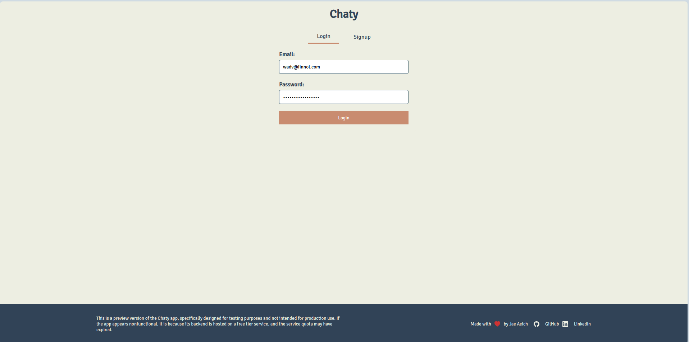
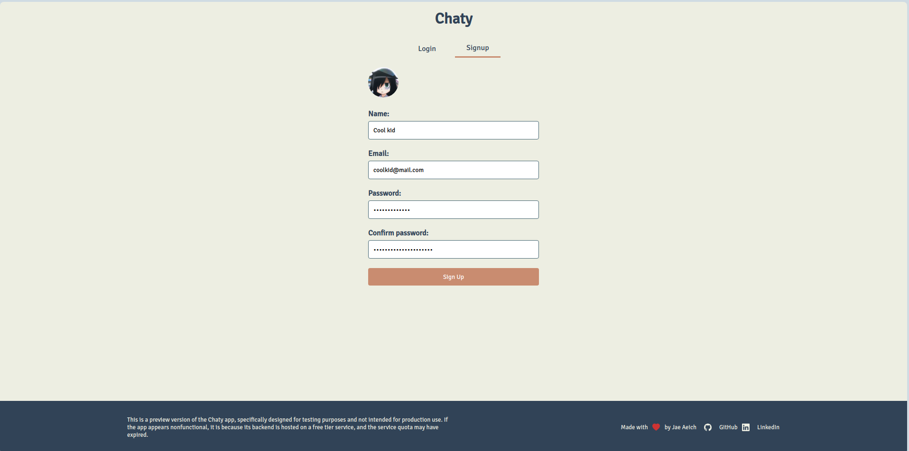
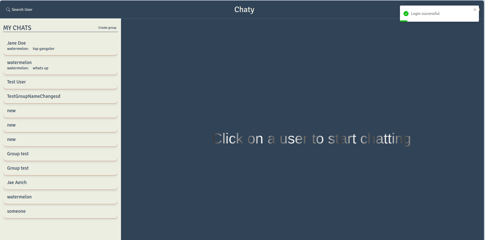
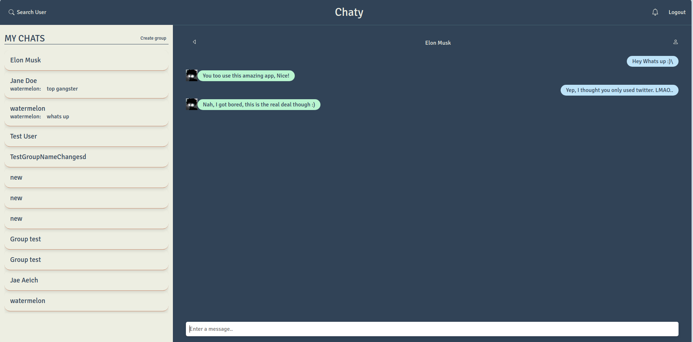
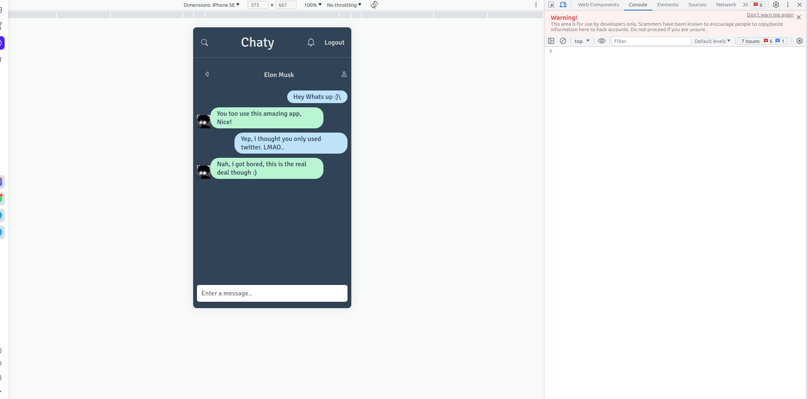
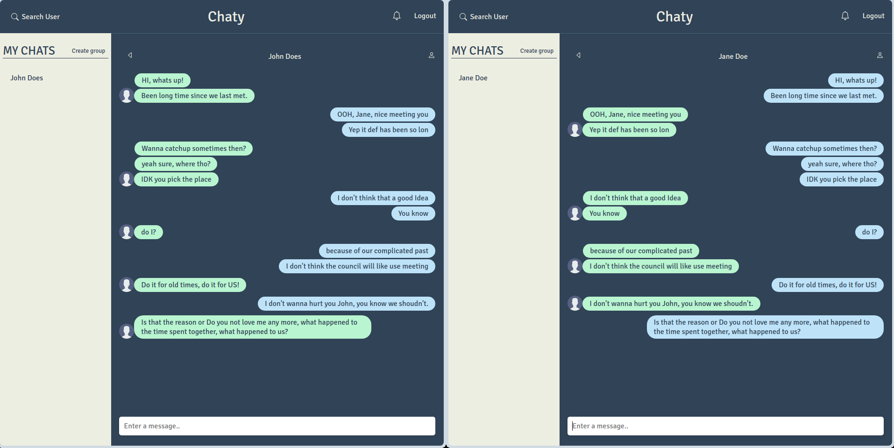
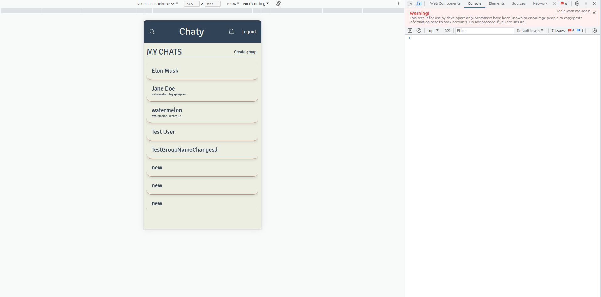
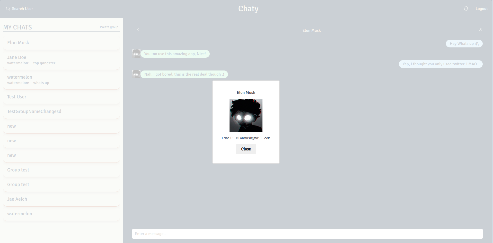
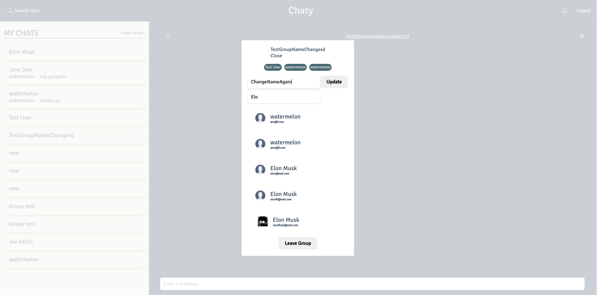

# Chaty - The Social Solution

Introducing Chaty, the cutting-edge social media app designed to bring people closer, spark meaningful connections, and revolutionize the way we interact in the digital world. With its sleek and intuitive interface, Chaty offers a seamless and delightful user experience, catering to users of all ages and backgrounds.

## Chaty API Reference

### User Routes

#### Get All Users

| User Routes           |                                                       |
| --------------------- | ----------------------------------------------------- |
| **Get All Users**     | `GET /api/user`                                       |
|                       | - **Auth Required:** Yes (using `protect` middleware) |
|                       |                                                       |
| **Register User**     | `POST /api/user`                                      |
|                       | - **Auth Required:** No                               |
|                       |                                                       |
| **Authenticate User** | `POST /api/user/login`                                |
|                       | - **Auth Required:** No                               |

```http
GET /api/user
```

- **Auth Required:** Yes (using `protect` middleware)

Fetches all users.

#### Register User

```http
POST /api/user
```

- **Auth Required:** No

Registers a new user.

#### Authenticate User (Login)

```http
POST /api/user/login
```

- **Auth Required:** No

Authenticates a user during login.

### Chat Routes

| Chat Routes                     |                                                       |
| ------------------------------- | ----------------------------------------------------- |
| **Access Chat**                 | `POST /api/chat`                                      |
|                                 | - **Auth Required:** Yes (using `protect` middleware) |
|                                 |                                                       |
| **Fetch Chats**                 | `GET /api/chat`                                       |
|                                 | - **Auth Required:** Yes (using `protect` middleware) |
|                                 |                                                       |
| **Create Group Chat**           | `POST /api/chat/group`                                |
|                                 | - **Auth Required:** Yes (using `protect` middleware) |
|                                 |                                                       |
| **Rename Group Chat**           | `PUT /api/chat/rename`                                |
|                                 | - **Auth Required:** Yes (using `protect` middleware) |
|                                 |                                                       |
| **Remove User from Group Chat** | `PUT /api/chat/groupremove`                           |
|                                 | - **Auth Required:** Yes (using `protect` middleware) |
|                                 |                                                       |
| **Add User to Group Chat**      | `PUT /api/chat/groupadd`                              |
|                                 | - **Auth Required:** Yes (using `protect` middleware) |

#### Access Chat

```http
POST /api/chat
```

- **Auth Required:** Yes (using `protect` middleware)

Grants access to a specific chat.

#### Fetch Chats

```http
GET /api/chat
```

- **Auth Required:** Yes (using `protect` middleware)

Fetches all chats.

#### Create Group Chat

```http
POST /api/chat/group
```

- **Auth Required:** Yes (using `protect` middleware)

Creates a new group chat.

#### Rename Group Chat

```http
PUT /api/chat/rename
```

- **Auth Required:** Yes (using `protect` middleware)

Renames an existing group chat.

#### Remove User from Group Chat

```http
PUT /api/chat/groupremove
```

- **Auth Required:** Yes (using `protect` middleware)

Removes a user from a group chat.

#### Add User to Group Chat

```http
PUT /api/chat/groupadd
```

- **Auth Required:** Yes (using `protect` middleware)

Adds a user to a group chat.

### Message Routes

| Message Routes                 |                                                       |
| ------------------------------ | ----------------------------------------------------- |
| **Get All Messages in a Chat** | `GET /api/message/:chatId`                            |
|                                | - **Auth Required:** Yes (using `protect` middleware) |
|                                |                                                       |
| **Send Message**               | `POST /api/message`                                   |
|                                | - **Auth Required:** Yes (using `protect` middleware) |

#### Get All Messages in a Chat

```http
GET /api/message/:chatId
```

- **Auth Required:** Yes (using `protect` middleware)

Fetches all messages in a chat.

#### Send Message

```http
POST /api/message
```

- **Auth Required:** Yes (using `protect` middleware)

Sends a new message.

These API endpoints enable various functionalities in the Chaty social media app, including user registration and authentication, accessing and managing chats, sending and receiving messages, and interacting with group chats. The app leverages Socket.IO for real-time communication between users, facilitating a seamless and engaging user experience.

## Authors

- [@JaeAeich](https://github.com/JaeAeich)

## Features

- User Registration and Authentication:

  - Users can register to create an account in the app.
  - Users can authenticate themselves through login.

- Fetching Users:

  - Users can fetch all users from the app.

- Chat Management:

  - Users can access a specific chat by providing appropriate authorization.
  - Users can fetch all chats available in the app.
  - Users can create a new group chat.
  - Users can rename an existing group chat.
  - Users can remove a user from a group chat.
  - Users can add a user to a group chat.

- Messaging:

  - Users can fetch all messages in a specific chat.
  - Users can send new messages in a chat.

- Real-Time Communication:
  - The app leverages Socket.IO for real-time communication, allowing seamless and instant updates in chats and messages.

These features collectively enable users to interact and communicate with each other effectively within the Chaty social media app. With user registration and authentication, users can securely create accounts and access their personalized chat experiences. The app offers versatile chat management, empowering users to create and manage both individual and group chats. Additionally, the messaging functionality facilitates real-time communication, ensuring messages are delivered and received instantly, providing an engaging and interactive user experience.

## Chaty Installation Guide

To install and run the Chaty app on your local machine, follow the steps below:

### Prerequisites

Before getting started, make sure you have the following installed on your system:

- Node.js (v14.x or later)
- MongoDB

### Clone the Repository

First, clone the Chaty repository to your local machine using Git:

```bash
git clone https://github.com/JaeAeich/Chaty.git
```

### Server Configuration

1. Navigate to the `server` folder:

```bash
cd chaty/server
```

2. Create a `.env` file in the `server` folder with the following content:

```env
PORT=4000
MONGO_URI=mongodb+srv://your-mongodb-connection-string
JWT_SECRET=your-jwt-secret
CLIENT_BASE_URL=http://localhost:5173
```

Replace `your-mongodb-connection-string` with your actual MongoDB connection string and choose a secure value for `JWT_SECRET`.

3. Install the server dependencies from the root folder:

```bash
npm install
```

4. Run the server in development mode with nodemon:

```bash
npm run dev
```

Alternatively, you can run the server without nodemon:

```bash
npm start
```

### Client Configuration

1. Navigate to the `client` folder:

```bash
cd chaty/client
```

2. Create a `.env` file in the `client` folder with the following content:

```env
VITE_BACKEND_BASE_URL=http://localhost:4000
```

3. Install the client dependencies:

```bash
npm install
```

4. Run the client in development mode:

```bash
npm run dev
```

### Accessing Chaty

Once the server and client are running, you can access the Chaty app in your browser by visiting `http://localhost:5173`.

Congratulations! You have successfully installed and configured Chaty on your local machine. You can now explore the app's features and functionalities.

Note: For production deployment, make sure to set appropriate environment variables and follow best security practices to ensure the app's safety and performance.

Enjoy using Chaty for seamless and engaging social interactions!

## Color Reference

| Variable          | Color Code |
| :---------------- | :--------- |
| --color-primary   | #314357    |
| --color-secondary | #456672    |
| --color-accent    | #e3b587    |
| --color-cta       | #c98c70    |
| --color-bg        | #edeee2    |

These are the key variables representing the colors used in the Chaty app. Each color is identified by its respective hexadecimal color code, allowing for easy reference and consistency in the app's design.

## Contributing

Contributions are always welcome!

See `contributing.md` for ways to get started.

Please adhere to this project's `code of conduct`.

## License

[MIT](https://choosealicense.com/licenses/mit/)

## Screenshots

- Login



- Signup



- Success Login



- Chat



- Small Screen



- Multi Screen



- Responsive Small screen chats



- Profile
  

- Group Setting
  

## Final Words

Thank you for taking the time to explore our project! We hope you found it insightful and valuable. Your support and feedback mean the world to us, and we truly appreciate your interest in our work.

If you have any questions, suggestions, or would like to contribute to this project, please don't hesitate to reach out. We believe that collaboration and community involvement are key to creating meaningful and impactful projects.

Once again, thank you for being a part of our journey. Happy coding! 🚀